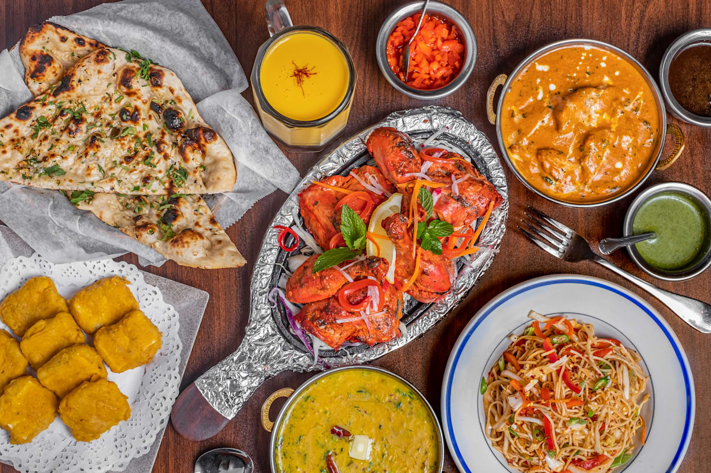

# Taj Mahal Restaurant - Poing, Germany

Welcome to the **Taj Mahal** restaurant web application! This project provides a digital presence for an authentic dining experience located in Poing, Germany, offering a unique blend of exquisite cuisine and an elegantly styled atmosphere.

## Project Overview

The Taj Mahal Restaurant website is built to offer a seamless, responsive, and visually captivating experience for guests. The web application effectively showcases the restaurant's culinary offerings, private event spaces, dedicated team, and vibrant ambiance. 

### Key Features

- **Home & Concept:** An inviting landing page that highlights the restaurant's passion for hospitality and elevated dining experiences.
- **Menu:** A digital presentation of the restaurant's diverse food and beverage offerings, including curated multi-course menus.
- **Groups & Events:** Detailed descriptions and visuals of our exclusive *Séparée* rooms (such as the Citronella, Private Dining Galerie, and Cicchetteria) designed for corporate events, weddings, and private gatherings.
- **Impressions:** A dynamic visual gallery highlighting the stylish interior, warm lighting, and thoughtfully designed spaces.
- **Team & Careers:** Insight into the passionate team behind the scenes and open career opportunities.
- **Contact & Reservations:** Seamless user flows for table reservations, directions, and ordering food for pickup.

### Visual Showcase

Here are a few glimpses of our restaurant's digital platform and beautiful ambiance:

#### Grand Atmosphere

#### Authentic Dining Experiences

#### Elegant Private Events

#### Delightful Cuisine

---
*Visit us at: Friedensstraße 9, 85586 Poing, Germany*
